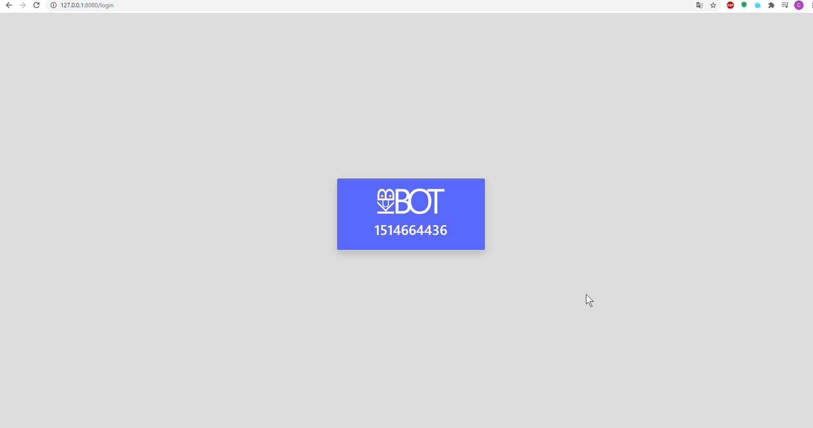
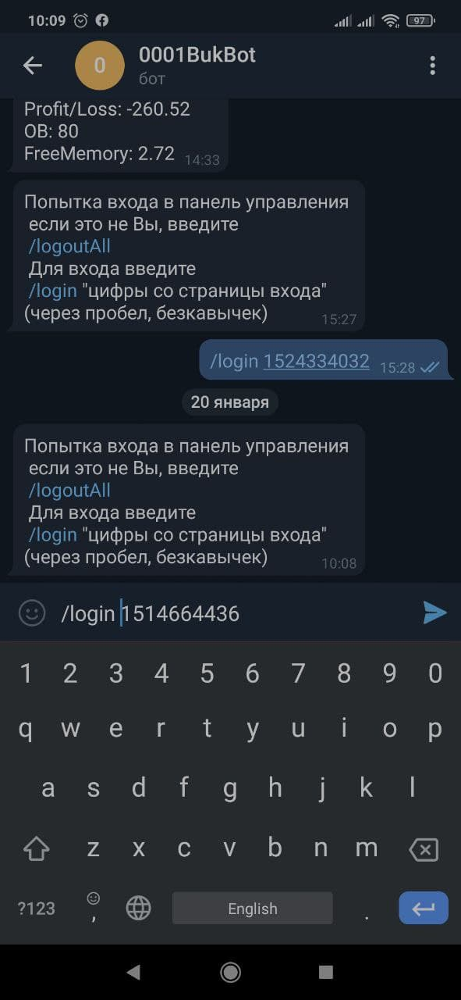
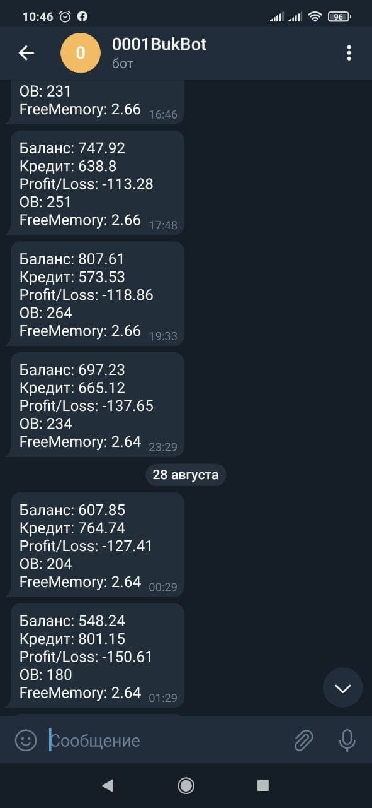
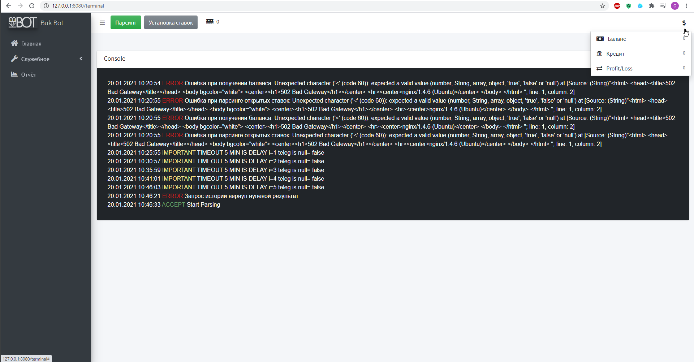

<h1 align="center">BukBot</h1>
<h2 align="center">
бот ставок на спорт(футбол)
</h2>

*Пример для резюме*

## Связка
Kotlin, SpringBoot/Security, Vue.js, Thymeleaf
 
Писался под Unix сервера, но может и на Win с парой оговорок

## Основное
- Авторизация через телеграм
- статистика через телеграм
- веб интерфейс Vue.js, Thymeleaf
- график изменения баланса
- работа с API Vodds
- эвенты
- мультипоток
- удаленная консоль в вебинтерфейсе
- оповещение о крит. ошибках
- логика сохранения баланса
- система мониторинга нагрузки на сервер
- разлиные алгоритмы анализа истории ставок для корректировки стратегии

## *Telegram авторизация*

 

## *Telegram статистика*

## *Web консоль*

